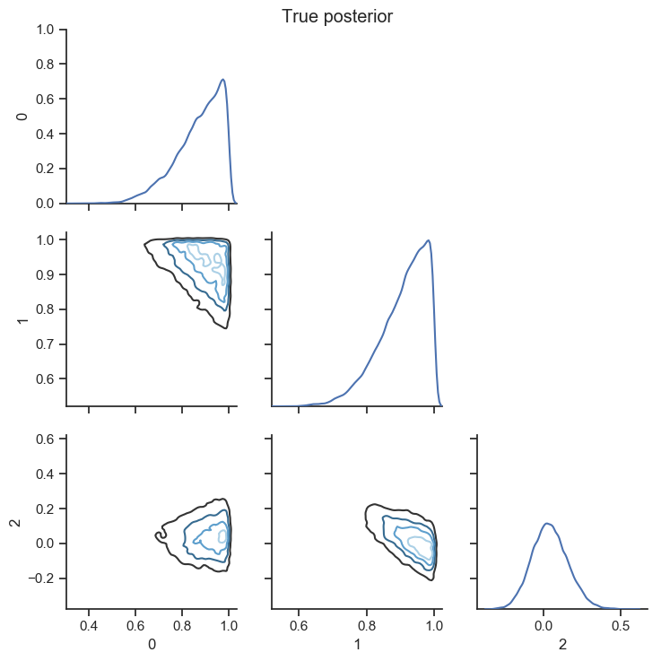
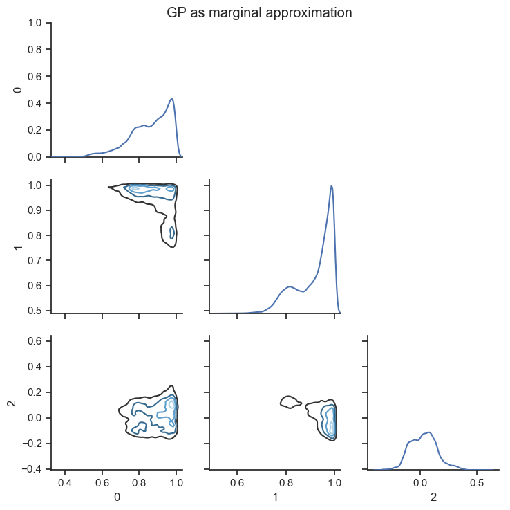

This code contains an example of using a Gaussian Process approximator in Bayesian inverse problems.  In particular we use the Gaussian Process Emulator during a simple MCMC estimating the solution to a PDE.

We look at two different examples.

The first example, `MCMC_A.py` is from section 5 of this [paper](http://dx.doi.org/10.1090/mcom/3244) (also available on [arXiv](https://arxiv.org/abs/1603.02004)).

The second example, `MCMC_CGSSZ.py` is using applying a Gaussian Process approximator to the problem from section 5 of this [paper](https://doi.org/10.1007/s11222-016-9671-0).  Here they have instead used a randomised PDE solver using random basis function for their FEM.
We randomise differently using a Gaussian process approximator.

### Results ###

Using a Gaussian process as a marginal approximation is recommended.  This is due to it running quicker than a random approximation - we don't have to compute any convex hulls - and both the marginal and random approximation having the same theoretical convergence speed.

The results for both of these examples are in the `output` folder.

Distribution using *true* solution to the PDE:

Distribution using a *marginal GP approximation*:

#### Computational time ####

All these computational time calculations were run on a Intel i5-6300HQ (4 core) CPU with 8GB RAM.

For `MCMC_A.py` with 100,000 length MCMC run, 3 dimensional parameter family, 1000 design points in total, using 1024 basis functions to solve the PDE and 20 observations we have:

Approximation | Time (mm:ss) 
 ---- | ---- 
True posterior (solving the PDE) | 3:57
GP as mean | 0:07 
GP as marginal approximation | 1:12 
GP as random approximation (one evaluation only) | 6:38

For `MCMC_CGSSZ.py` with 100,000 length MCMC run, 3 dimensional parameter family, 1000 design points in total, using 1024 basis functions to solve the PDE and 9 observations we have:

Approximation | Time (mm:ss) 
 ---- | ---- 
True posterior (solving the PDE) | 4:35
GP as mean | 0:31 
GP as marginal approximation | 1:33 
GP as random approximation (one evaluation only) | 6:38

Note because the code currently has a naive way of searching spatial data the Gaussian process as a random approximation currently runs in `O(n^3)`, where `n` is number of steps in the MCMC run.
However, using a Gaussian process as a marginal approximation runs in `O(n)`.
Using an R* Tree (or another tree type data structure) we could potentially reduce this down to `O(n*log(n))` in a best case scenario.  The best case scenario is when there aren't too many corner cases when finding an approximate convex hull of a point.  However, when we have a higher dimensional parameter space this more naive implementation isn't too far from being optimal.

### How do I get set up? ###

Required dependencies:

	numpy, scipy, matplotlib, seaborn, pandas

Optional dependencies:

	hypothesis and tqdm

If the optional dependencies are not installed then `MCMC_A.py` and `MCMC_CGSSZ.py` will run fine but there won't be a progress bar.

`tqdm` is used to give a progress bar for the MCMC run contained in `MCMC.py` but the code will adapt if the `tqdm` is not installed.

`hypothesis` is only required for running the test code (`test_GaussianProcess.py`).
	

### How do I run the code ###
Simply run `python MCMC_A.py` or `python MCMC_CGSSZ.py`
See the above file for different plotting and posterior distribution options.

### Testing ####
The tests are contained in `test_GaussianProcess.py`.  Since we're dealing with randomness most of the tests are graphical.  Simply uncomment the required tests at the bottom of the file.
